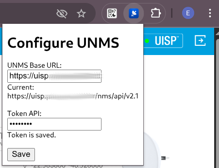
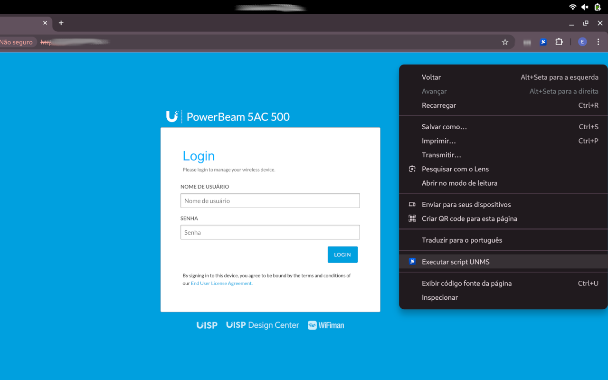
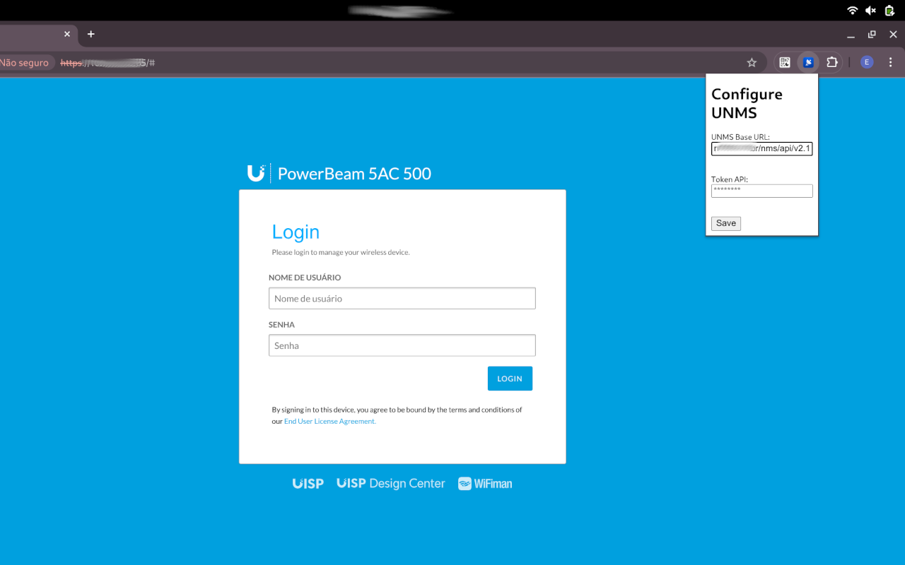

# UISP Extension

Essa extensão é bem simples não faz nem tratamento de erros.

Se o IP estiver cadastrado no UISP ele tenta gerar um ticket para logar.

Configure a URL e um token de acesso.



Na URL termine com /nms/api/v2.1

# TODO
- Exibir reação ao salvar
- Tratar erros
- Pensar em pedir para abrir o cofre
- Dar opção de salvar senha do Device
- Configutar o UISP se estiver desconfigurado.
- Trabalhar com a senha e não com token

# Chorme Web Store

## Pagina

### Detalhes do Produto

#### Titulo

UNMS Extension

#### Resumo

Extension to interact with UNMS API.

#### Descrição

This extension is intended to facilitate passwordless login, requiring only a right-click and a click in the context menu to open all devices connected to the UISP.

Legal Notice:
This extension is an independent, user-developed tool created solely to simplify access to device redirect tickets. It is not affiliated with, endorsed by, or associated with Ubiquiti Inc. or any of its products or services. All trademarks and product names mentioned are the property of their respective owners.

#### Categoria

Ferramenta

#### Idioma
Português (Brasil)

### Recursos gráficos

#### Ícone da Store


#### Capturas de tela





## Privacidade

### Unico proposito

It allows you to log in without a password, simply by clicking on the context menu. A UISP ticket will be used.
Allow the user to generate a UNMS redirect ticket for the currently opened device page. It performs this action only when the user explicitly selects the extension’s context-menu option. The extension does not provide any additional features beyond generating the ticket and redirecting the user to the device’s ticket URL.

### Justificativa da permissão

#### Storage

Used to locally save two configuration values (BASE URL, TOKEN) provided by the user. These values are stored only on the user’s device and are not sent anywhere.

#### ActiveTab

Required to allow the extension to access the content of the currently active tab, and only after the user interacts with the extension.

#### contextMenu

Required to add an item to the browser’s right-click menu. The extension only performs actions when the user selects this menu item.

#### scripting

Required to inject a small script into the current page, but only after the user triggers the action. The script is used to read the current URL or execute simple logic requested by the user. No data is collected or transmitted.


# Mozilla

``` bash
npm install --global web-ext
cd /caminho/para/sua/extensao
web-ext lint
```

``` bash
web-ext build
```

Isso gera a pasta web-ext-artifacts e dentro dela o arquivo <extensão>-<versão>.zip

Crie sua chave de API:
https://addons.mozilla.org/pt-BR/developers/addon/api/key/

```
web-ext sign --api-key= --api-secret= --channel
```
obs: Não consegui colocar a licensa preciso de mais informações então subi manualmente.
