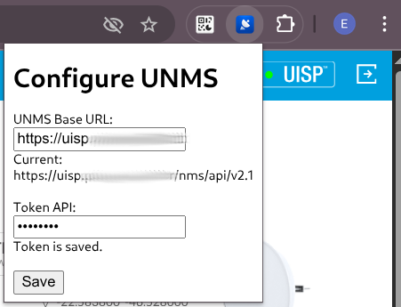
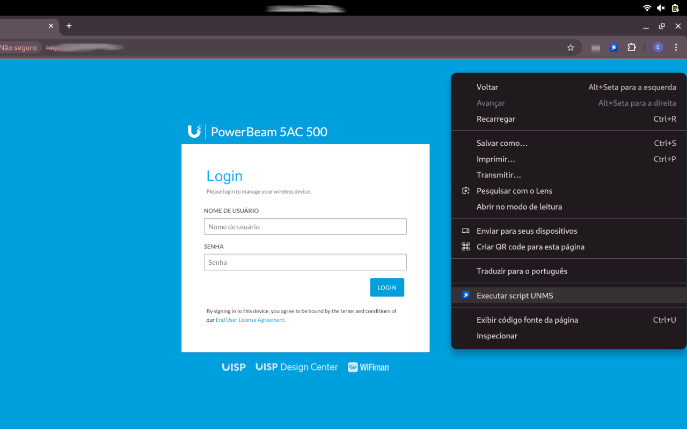
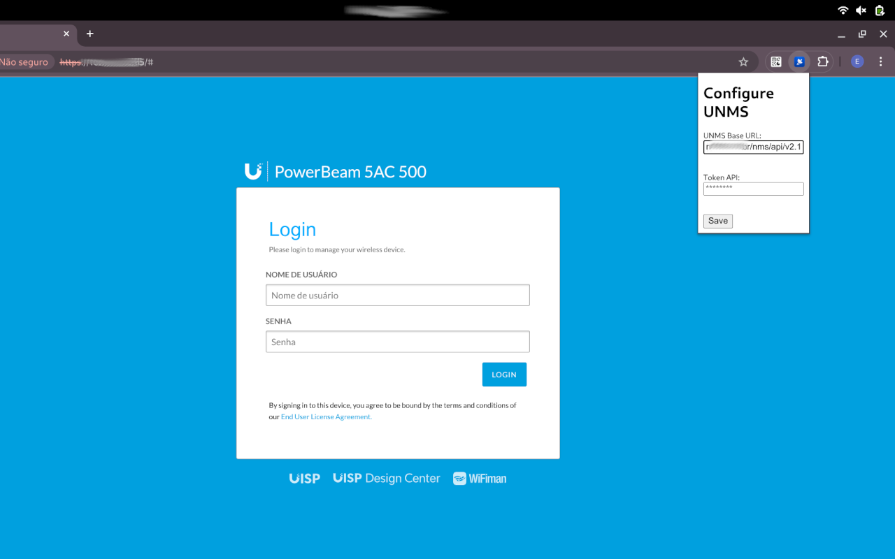

### 📥 Instalação

[](https://chromewebstore.google.com/detail/uisp-extension/lkhlfljkbndcamfhokelojicpadgdfig)
[](https://chromewebstore.google.com/detail/uisp-extension/lkhlfljkbndcamfhokelojicpadgdfig)

[](https://addons.mozilla.org/pt-BR/firefox/addon/uisp-extension/)
[](https://addons.mozilla.org/pt-BR/firefox/addon/uisp-extension/)

# UISP Extension

FONTE: https://github.com/intera-net-br/uisp-extension

Essa extensão é bem simples, não faz sequer tratamento de erros.

Se o IP estiver cadastrado no UISP, ele tenta gerar um ticket para fazer login.

Configure a URL e um token de acesso.



Na URL, finalize com /nms/api/v2.1

## Usando com assistentes de IA

A partir da versão 1.2, um assistente de IA com acesso ao navegador consegue entrar nos equipamentos quando você pede, por exemplo, *"entra no rádio 10.0.0.5"*. A integração é feita por uma skill no formato aberto `SKILL.md`.

Instruções e skill: https://intera-net-br.github.io/uisp-extension/

Como funciona:

1. A skill `uisp-login` manda o assistente abrir a página do equipamento (`https://IP/`) e, a partir dela, navegar para `https://intera-net-br.github.io/uisp-extension/login.html#IP` (pasta [`docs/`](./docs), publicada no GitHub Pages). O IP vai depois do `#`, que o navegador não envia ao GitHub.
2. A extensão (`content.js`, que só roda nessa página) confere o referrer: se a navegação partiu do próprio equipamento (host do referrer igual ao IP), segue sozinha. Nenhum outro site consegue produzir esse referrer. Nos demais casos, mostra o botão "Entrar em IP", que só aceita clique real (`event.isTrusted`). Nada funciona dentro de iframe.
3. O `background.js` busca o IP no UISP, exige correspondência exata, gera o ticket e redireciona a aba para o IP **devolvido pelo UISP**.

O `login.html` registra um service worker ([`docs/sw.js`](./docs/sw.js)) que guarda uma cópia local da página. Depois da primeira visita (feita ao clicar em "Preparar uso por assistente de IA"), a página abre mesmo com o GitHub fora e a navegação, que leva o referrer do equipamento, não sai do navegador. A cópia é atualizada no máximo uma vez por dia, sem referrer. Além disso, ao abrir a página o próprio navegador confere se o `sw.js` mudou; com `updateViaCache: "all"` essa checagem respeita o cache HTTP do GitHub Pages (10 minutos) e não leva o IP do equipamento (testado: o `Referer` é o próprio `sw.js`). Assim o GitHub pode perceber que a página foi aberta e em que horário, mas não em qual equipamento. Sem a cópia local (janela anônima, dados do navegador apagados), a página vem da rede e o GitHub recebe o IP do equipamento no cabeçalho `Referer`.

O token nunca sai da extensão: nem a página nem o assistente têm acesso a ele.

Nenhuma permissão nova é necessária: a extensão chama o UISP pelo mesmo CORS que a versão 1.1 já usava. Para já deixar a cópia local pronta, abra o popup e clique em **Preparar uso por assistente de IA**. O clique direito funciona igual à versão 1.1.

Instalação da skill: use o [`uisp-login-skill.zip`](https://github.com/intera-net-br/uisp-extension/releases/latest/download/uisp-login-skill.zip) da última release ou o [`SKILL.md`](./plugin/skills/uisp-login/SKILL.md) conforme o seu assistente. Ferramentas que aceitam marketplace de plugins no formato `.claude-plugin` podem instalar direto deste repositório (ex.: `/plugin marketplace add intera-net-br/uisp-extension` e `/plugin install uisp-login@uisp-extension`).

A fonte da skill é [`plugin/skills/uisp-login/SKILL.md`](./plugin/skills/uisp-login/SKILL.md). Depois de alterá-la, rode `scripts/build.sh` para atualizar a cópia em `docs/`.

## Releases

Gere os arquivos localmente e publique a release pelo `gh` (ou pela página *Releases › Draft a new release* do GitHub, arrastando os arquivos de `dist/`):

```bash
scripts/build.sh
git tag v1.2 && git push origin v1.2
gh release create v1.2 dist/*.zip --title v1.2 --generate-notes
```

Para trocar os arquivos de uma release existente: `gh release upload v1.2 dist/*.zip --clobber`.

Arquivos gerados em `dist/`:

- `uisp-login-skill.zip`: a skill para assistentes de IA;
- `uisp-extension-chrome.zip`: a extensão para Chrome. Para instalar sem a loja, descompacte e use *chrome://extensions › Modo do desenvolvedor › Carregar sem compactação*. É também o pacote enviado à Chrome Web Store;
- `uisp-extension-firefox.zip`: a extensão para Firefox, sem assinatura. Sem a loja, só carrega temporariamente em *about:debugging › Este Firefox › Carregar extensão temporária*. É também o pacote enviado à AMO.

Mantenha esses nomes: os links da página usam `releases/latest/download/<nome>`, que sempre aponta para a release mais recente.

Para uso normal, prefira instalar pelas lojas (links no topo).

Para publicar a página: *Settings › Pages › Deploy from branch › main /docs*.

# TODO
- Tratar erros
- Pensar em pedir para abrir o cofre
- Dar opção de salvar senha do Device
- Configurar o UISP se estiver desconfigurado.
- Trabalhar com a senha e não com token

# Chorme Web Store

## Página

### Detalhes do Produto

#### Titulo

UISP Extension

#### Resumo

Extension to interact with UISP API.

#### Descrição

This extension is intended to facilitate passwordless login, requiring only a right-click and a click on the context menu to open all devices connected to the UISP.

It can also be used by AI assistants with browser access, through the "uisp-login" skill: https://intera-net-br.github.io/uisp-extension/

Free and open source software (GPL-3.0): https://github.com/intera-net-br/uisp-extension

Legal Notice:
This extension is an independent, user-developed tool created solely to simplify access to device redirect tickets. It is not affiliated with, endorsed by, or associated with Ubiquiti Inc. or any of its products or services. All trademarks and product names mentioned herein are the property of their respective owners.

#### Categoria

Ferramenta

#### Idioma
Português (Brasil)

### Recursos gráficos

#### Ícone da Store


#### Capturas de tela





## Privacidade

### Único proposito

Allows you to log in without a password, simply by clicking on the context menu. A UISP ticket will be used.
Allow the user to generate a UISP redirect ticket for the currently opened device page. It performs this action only when the user explicitly selects the extension’s context-menu option, or clicks the "Log in" button on the extension's login page. The extension does not provide any additional features beyond generating the ticket and redirecting the user to the device’s ticket URL.

### Justificativa da permissão

#### Storage

Used to locally save two configuration values (Base URL, Token) provided by the user. These values are stored only on the user’s device and are not sent anywhere.

#### ActiveTab

Required to allow the extension to access the content of the currently active tab and only after the user interacts with the extension.

#### contextMenu

Required to add an item to the browser’s right-click menu. The extension only performs actions when the user selects this menu item.

#### scripting

Required to inject a small script into the current page, but only after the user triggers the action. The script is used to read the current URL or execute simple logic requested by the user. No data is collected or transmitted.

#### Host permission: content script (intera-net-br.github.io/uisp-extension only)

The only host access the extension declares. The content script runs only on the extension's own page https://intera-net-br.github.io/uisp-extension/, published from the open source repository. There, the user or an AI assistant with browser access can request a UISP login ticket for a device IP: automatically when the navigation comes from that device's own page, otherwise after a real click on a button. The UISP API token is never exposed to the page. Calls to the UISP API are made by the background script using the CORS headers of the UISP server (same as version 1.1), with no host permission.


# Mozilla

``` bash
npm install --global web-ext
cd /caminho/para/sua/extensao
web-ext lint
```

``` bash
web-ext build
```

Isso gera a pasta web-ext-artifacts e dentro dela o arquivo <extensão>-<versão>.zip

Crie sua chave de API:
https://addons.mozilla.org/pt-BR/developers/addon/api/key/

```
web-ext sign --channel listed --amo-metadata amo-metadata.json --approval-timeout 0
```

As chaves vão nas variáveis `WEB_EXT_API_KEY` e `WEB_EXT_API_SECRET` (nunca no repositório). O `amo-metadata.json` define a licença e a nota para o revisor:

```json
{
  "version": {
    "license": "GPL-3.0-only",
    "approval_notes": "Source code: https://github.com/intera-net-br/uisp-extension (GPL-3.0). No build step, files are not minified."
  }
}
```

A AMO não aceita `GPL-3.0-or-later`; o identificador é `GPL-3.0-only`.

# Licença

[GPL-3.0](./LICENSE). Projeto independente, sem relação com a Ubiquiti Inc.
